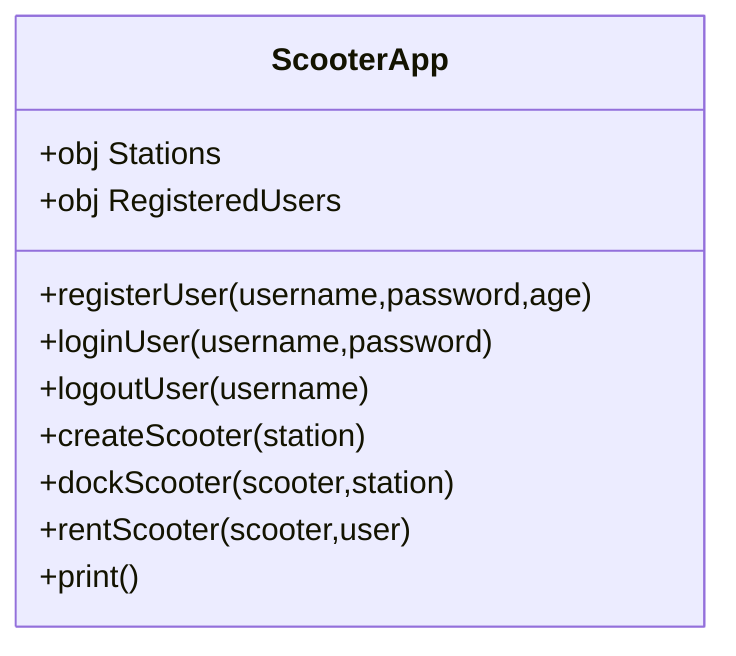

```mermaid
classDiagram
  class ScooterApp
    ScooterApp: +obj Stations
    ScooterApp: +obj RegisteredUsers

    ScooterApp: +registerUser(username,password,age)
    ScooterApp: +loginUser(username,password)
    ScooterApp: +logoutUser(username)
    ScooterApp: +createScooter(station)
    ScooterApp: +dockScooter(scooter,station)
    ScooterApp: +rentScooter(scooter,user)
    ScooterApp: +print()

```